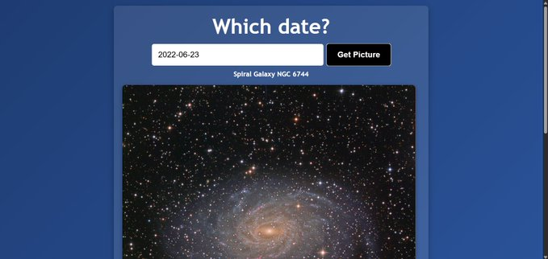
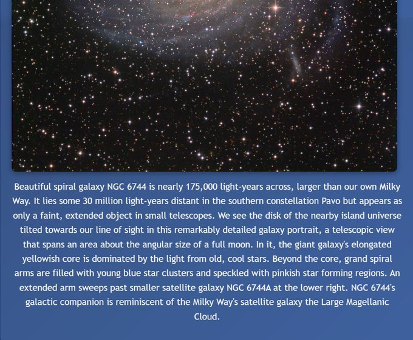

# NASA Project App

This project lets the user search any date for the NASA Astronomy Picture of the day!

## How It's Made:

**Tech used:** HTML, CSS, and JavaScript

I used html for the markup, css for the styling, andI used Javascript for the logic of this project.

## Lessons Learned:

i had an issue where i would go to a video, then image, then video then the image wouldn't show up and thats 
because the display none property on the image did not go away, so when an image is present,
i will always make it a block level element 

## Image of Project:

